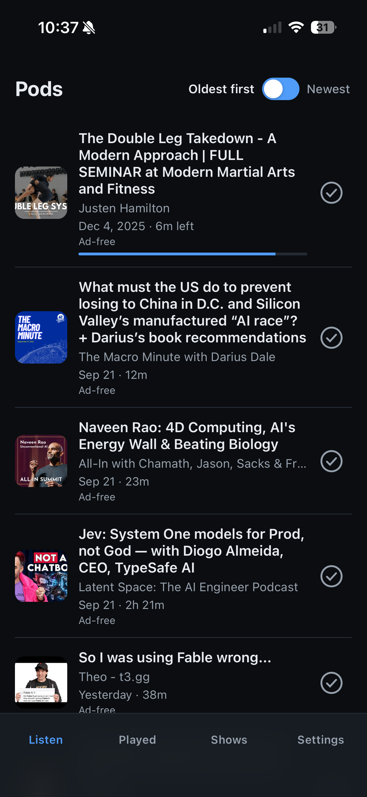
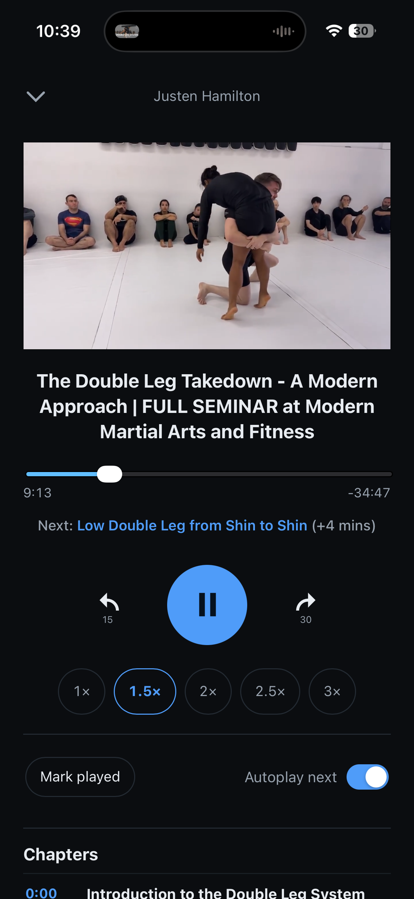

# Pods

Pods is a personal podcast app for Chrome on iPhone and iPad. The phone keeps the library and downloaded episodes. A Mac on the same [Tailscale](https://tailscale.com) network refreshes feeds, removes ads, writes show notes, and syncs listening state while it is awake.

Listen is the unplayed queue, oldest first. Open an episode for the player.

<p>
  
  
</p>

The app is [MIT licensed](LICENSE). It is built for one person, with a passkey on that person's devices. Listen shows subscriptions only.

The deployed client is [pods.mcgiv.dev](https://pods.mcgiv.dev). A checkout is the source for that app. Running it yourself means running the Mac backend and hosting the static client. The native iPhone app under `ios/` is deprecated as of 1 October 2026 and is kept only for history. See [ios/DEPRECATED.md](ios/DEPRECATED.md).

## Features

**Library.** Listen, Played, Shows, and Settings, with a horizontal swipe between the main tabs. Listen is unplayed episodes, oldest first. Marking an episode played moves it to Played. Search lives inside Shows and covers Podcast Index results plus episodes already in the library.

**Subscriptions.** Subscribe from search or by pasting an RSS URL. A new subscription keeps the two newest episodes and archives the older ones. Import and export OPML, and unsubscribe from a show. Paste a YouTube channel to subscribe, or a single video URL to add that video to Listen without subscribing. YouTube downloads are H.264/AAC, capped at 720p.

**Playback.** Scrubber, 15-second skip back, 30-second skip forward, speeds from 1× through 3×, autoplay of the next episode, and a mini player. Choose iPhone or Mac from the player. The Mac plays the processed file through an authenticated session, and progress syncs back. Downloaded episodes keep playing when the Mac is asleep. Listen, Played, Shows, search, and mark-played stay on the phone. Feed refresh and new downloads wait until the Mac is reachable again.

**Sync.** The same passkey signs in on iPhone and iPad. Progress, including rewinds, played state, subscriptions, playback preferences, appearance, and the last-listened episode are shared. Each device keeps its own downloads and storage limit. Edits made offline stay queued until the Mac acknowledges them. Settings can show a conflict between this device and the shared value.

**Processing.** An episode appears in Listen only after the Mac has cut the ads and written show notes. Transcription is local Whisper large-v3. Ad classification is TypeSafe Jev 1.13: each segment is `ad` or `content`, and mixed or unclear audio stays `content`. The published file has those ad ranges removed. Show notes, chapters, and the Listen title come from local oMLX (`Qwen3.8-27B-4bit`, reasoning effort `low`). A Listen title is a guest name plus three to five words when the episode names a guest, otherwise just the short description, with subdued capitalization. The original feed title is unchanged. Set `"classifier": "omlx"` in the Mac config to classify with the local model instead of Jev.

Failed processing retries at most four times, then the episode stays unpublished. A busy local model or low memory does not use up an attempt. The Mac menu-bar app can pause new transcription and classification for up to four hours. Downloads, sync, and playback continue. Listen shows a notice while a job is waiting to retry or is blocked.

**Appearance.** System, light, or dark.

Guest-appearance following exists in the client and stays off (`FOLLOW_APPEARANCES_ENABLED` in `client/src/config.ts`).

## Layout

| Path | Role |
|------|------|
| `client/` | React UI. Runtime dependencies are `react` and `react-dom` only. |
| `backend/` | Rust library and HTTP API (`Backend::handle`). |
| `mac/backend/` | Mac service manager, transcription helper, and inference lock. |
| `mac/PodsSpeaker/` | Menu-bar app for the processing queue and its pause switch. |
| `docs/` | Mac backend, offline client, speaker, and local-inference notes. `docs/screens.html` is a static render of the phone screens. |
| `dev/` | Isolated container workflow for the client toolchain. |
| `ios/` | Deprecated iPhone app. Do not extend it. |
| `shared/` | Small shared Swift helpers. |

## Development

Client installs and builds run inside a Linux VM (`pods-dev`) via Apple's [`container`](https://github.com/apple/container) CLI. Run `npm`, `npx`, and `node` only inside that guest. The guest mounts `client/` only. `node_modules/` stays in the guest. Git, credentials, and the library database stay on the host. Details and the reason are in [AGENTS.md](AGENTS.md).

You need macOS, Rust and Cargo, Python 3.11 through 3.13, [`uv`](https://docs.astral.sh/uv/), and the `container` CLI. A full Mac install also needs the Whisper checkpoint, a local oMLX server, a TypeSafe API key for Jev, and Tailscale between the phone and the Mac.

### Client

```sh
dev/up.sh        # build the image and start pods-dev
dev/sh.sh        # shell inside the container
dev/check.sh     # Vitest with the coverage gate (90% lines, statements, and functions)
```

The Vite dev server is [http://127.0.0.1:5173](http://127.0.0.1:5173). Inside the container, from `/work/client`:

```sh
npm run dev
npm run build
```

The production client is a static build uploaded to Cloudflare Pages. The steps are in [docs/mac-backend.md](docs/mac-backend.md) under **Deploy the client**.

If `container` crash-loops with `cannot find any plugins with type network`, Homebrew's bottle has not linked its plugins. Once:

```sh
ln -sfn /opt/homebrew/opt/container/libexec/container-plugins /opt/homebrew/libexec/container-plugins
launchctl kickstart -k gui/$(id -u)/com.apple.container.apiserver
```

Headless starts should use `container system start --enable-kernel-install`. Install or reinstall the kernel with `container system kernel set --recommended`.

### Backend

```sh
cargo test --manifest-path backend/Cargo.toml --features passkey
python3 -m unittest discover -s mac/backend -p 'test_*.py'
```

The Mac browser service refuses to start unless `PODS_AUTH_MODE=passkey`.

### Credentials

Podcast Index and TypeSafe keys stay in `~/.config/podcasts/credentials.env` (mode `0600`). Leave that file uncommitted. The browser build never includes it.

```sh
PODCASTINDEX_KEY=...
PODCASTINDEX_SECRET=...
TYPESAFE_API_KEY=...
```

`PODCASTINDEX_BASE_URL` defaults to `https://api.podcastindex.org/api/1.0`. Without Podcast Index keys, library search still works and directory search reports that it is not configured. RSS subscribe still works. Jev classification needs `TYPESAFE_API_KEY`.

### Run the Mac service

Production layout, Tailscale, certificates, backups, and the processing queue are documented in [docs/mac-backend.md](docs/mac-backend.md). After `dev/up.sh` is up:

```sh
uv sync --project mac/backend --frozen
python3 mac/backend/manage.py install
python3 mac/backend/manage.py agent
```

`install` builds the release backend, builds the client inside `pods-dev`, and points `~/.local/share/pods/current` at that release. `agent` prints the `launchctl bootstrap` command. Start the service with that printed command. Restart a running service with `launchctl kickstart -k gui/$(id -u)/dev.mcgiv.pods-backend`.

Enroll a passkey on the Mac. The command prints a single-use URL that expires after 15 minutes. Do not share it.

```sh
python3 mac/backend/manage.py enroll
```

List eligible processing jobs, or ask for a fresh automatic run of one episode. Retry starts that automatic run again.

```sh
python3 mac/backend/manage.py jobs
python3 mac/backend/manage.py retry EPISODE_ID
```

The cooperative GPU lock, oMLX autostart, and memory deferral are in [docs/local-inference.md](docs/local-inference.md). Play-on-Mac behavior is in [docs/mac-speaker.md](docs/mac-speaker.md).

The display name is `APP_NAME` in `client/src/config.ts` and `client/public/manifest.webmanifest`. Change both.

## License

[MIT](LICENSE). Copyright 2026 Matt McGivney.
